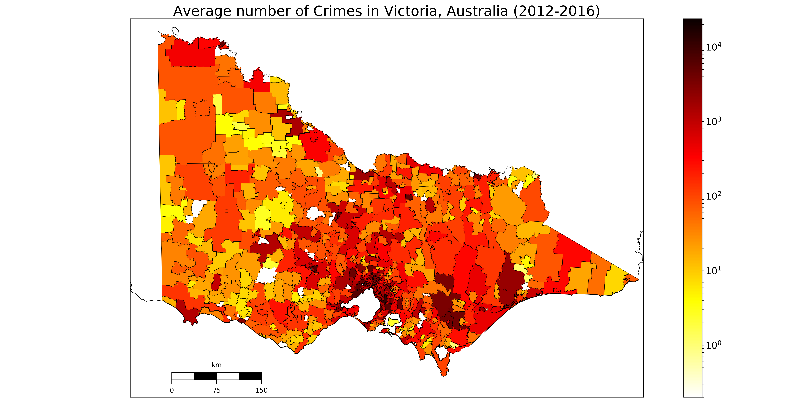
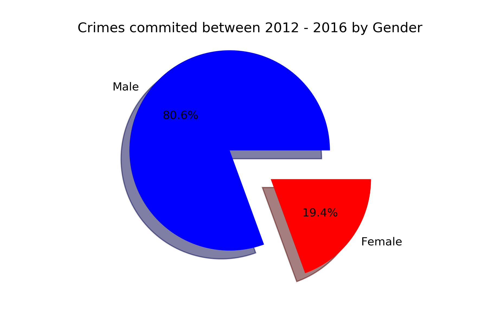

# Crimes

The data that we used can be found on the Research Platforms github repository [OpenRes](https://github.com/Vin-n/OpenRes/tree/master/Event%20Data/Victorian_Crime_Statistics). 

 

## Gender Distribution of Crimes

## Gender Distribution of Crimes per Age Group

## Gender Distribution of Sex Offenders per Age Group

## Gender Distribution of Victims of Sexual Offences per Age Group

