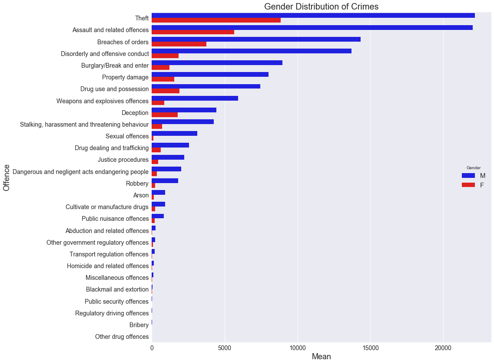

# OpenRes

The data that we used can be found on the Research Platforms github repository [OpenRes](https://github.com/Vin-n/OpenRes/tree/master/Event%20Data/Victorian_Crime_Statistics). 

# Crimes

