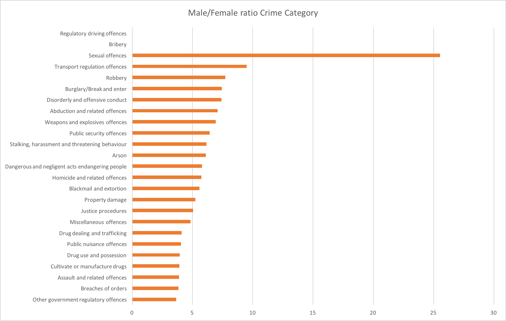

The data that we used can be found on the Research Platforms github repository [OpenRes](https://github.com/Vin-n/OpenRes/tree/master/Event%20Data/Victorian_Crime_Statistics). 

## Crime statistics in Victoria between 2012-2016 (geographical distribution and gender ratio)

__More crime happens in the cities. Possibly correlated with population density__

__Males commit significantly more crimes than females__

## Gender and Age Distribution of Crimes

* Data missing for :Male Other drug offences, Female Bribery, Female Other drug offences, Female Public security offences, Female Regulatory driving offences 

__Male to female ration is highest in sexual offences__

## Gender Distribution of Sexual Offences

*Data not complete for 50-54 and 60+ Females

__Males and females in the age group of 15-19 are more likely to commit sex crimes__

__Females in the age group 15-19 are most likely to be victims, whereas most of the male victims are 10-14 years old__

## Considering the age groups of the sex offenders and victims (and other crimes), more awareness and intervention stratergies are required, especially at schools.
