```python
import pandas as pd
import matplotlib.pyplot as plt
import seaborn as sns
% matplotlib inline
```

# Crime by Category x gender


```python
CatGenderDt = pd.read_csv('CrimebyCategoryxgender.csv')
CatGenderDt.shape
```


    (56, 7)


```python
CatGenderDt.head()
```


<div>
<style>
    .dataframe thead tr:only-child th {
        text-align: right;
    }

    .dataframe thead th {
        text-align: left;
    }

    .dataframe tbody tr th {
        vertical-align: top;
    }
</style>
<table border="1" class="dataframe">
  <thead>
    <tr style="text-align: right;">
      <th></th>
      <th>cat</th>
      <th>gender</th>
      <th>y_2012</th>
      <th>y_2013</th>
      <th>y_2014</th>
      <th>y_2015</th>
      <th>y_2016</th>
    </tr>
  </thead>
  <tbody>
    <tr>
      <th>0</th>
      <td>A10</td>
      <td>M</td>
      <td>158.0</td>
      <td>117</td>
      <td>138.0</td>
      <td>167.0</td>
      <td>148.0</td>
    </tr>
    <tr>
      <th>1</th>
      <td>A20</td>
      <td>M</td>
      <td>19060.0</td>
      <td>21646</td>
      <td>21954.0</td>
      <td>22469.0</td>
      <td>25075.0</td>
    </tr>
    <tr>
      <th>2</th>
      <td>A30</td>
      <td>M</td>
      <td>2714.0</td>
      <td>2899</td>
      <td>3117.0</td>
      <td>3148.0</td>
      <td>3675.0</td>
    </tr>
    <tr>
      <th>3</th>
      <td>A40</td>
      <td>M</td>
      <td>238.0</td>
      <td>219</td>
      <td>242.0</td>
      <td>250.0</td>
      <td>293.0</td>
    </tr>
    <tr>
      <th>4</th>
      <td>A50</td>
      <td>M</td>
      <td>2030.0</td>
      <td>1804</td>
      <td>1472.0</td>
      <td>1682.0</td>
      <td>2068.0</td>
    </tr>
  </tbody>
</table>
</div>


```python
CatGenderDt.columns= 'Category', 'Gender', '2012', '2013', '2014', '2015', '2016'
# Mean of the 5 years per category
CatGenderDt['Mean'] = [(CatGenderDt.iloc[i])[['2012', '2013', '2014', '2015', '2016']].mean() for i in range(CatGenderDt.shape[0])]
```


```python
CatGenderDt.head()
```


<div>
<style>
    .dataframe thead tr:only-child th {
        text-align: right;
    }

    .dataframe thead th {
        text-align: left;
    }

    .dataframe tbody tr th {
        vertical-align: top;
    }
</style>
<table border="1" class="dataframe">
  <thead>
    <tr style="text-align: right;">
      <th></th>
      <th>Category</th>
      <th>Gender</th>
      <th>2012</th>
      <th>2013</th>
      <th>2014</th>
      <th>2015</th>
      <th>2016</th>
      <th>Mean</th>
    </tr>
  </thead>
  <tbody>
    <tr>
      <th>0</th>
      <td>A10</td>
      <td>M</td>
      <td>158.0</td>
      <td>117</td>
      <td>138.0</td>
      <td>167.0</td>
      <td>148.0</td>
      <td>145.6</td>
    </tr>
    <tr>
      <th>1</th>
      <td>A20</td>
      <td>M</td>
      <td>19060.0</td>
      <td>21646</td>
      <td>21954.0</td>
      <td>22469.0</td>
      <td>25075.0</td>
      <td>22040.8</td>
    </tr>
    <tr>
      <th>2</th>
      <td>A30</td>
      <td>M</td>
      <td>2714.0</td>
      <td>2899</td>
      <td>3117.0</td>
      <td>3148.0</td>
      <td>3675.0</td>
      <td>3110.6</td>
    </tr>
    <tr>
      <th>3</th>
      <td>A40</td>
      <td>M</td>
      <td>238.0</td>
      <td>219</td>
      <td>242.0</td>
      <td>250.0</td>
      <td>293.0</td>
      <td>248.4</td>
    </tr>
    <tr>
      <th>4</th>
      <td>A50</td>
      <td>M</td>
      <td>2030.0</td>
      <td>1804</td>
      <td>1472.0</td>
      <td>1682.0</td>
      <td>2068.0</td>
      <td>1811.2</td>
    </tr>
  </tbody>
</table>
</div>


```python
catdf=pd.read_csv('Categories.csv', index_col='Category')
catdf.head()
```


<div>
<style>
    .dataframe thead tr:only-child th {
        text-align: right;
    }

    .dataframe thead th {
        text-align: left;
    }

    .dataframe tbody tr th {
        vertical-align: top;
    }
</style>
<table border="1" class="dataframe">
  <thead>
    <tr style="text-align: right;">
      <th></th>
      <th>Offence</th>
    </tr>
    <tr>
      <th>Category</th>
      <th></th>
    </tr>
  </thead>
  <tbody>
    <tr>
      <th>A10</th>
      <td>Homicide and related offences</td>
    </tr>
    <tr>
      <th>A20</th>
      <td>Assault and related offences</td>
    </tr>
    <tr>
      <th>A30</th>
      <td>Sexual offences</td>
    </tr>
    <tr>
      <th>A40</th>
      <td>Abduction and related offences</td>
    </tr>
    <tr>
      <th>A50</th>
      <td>Robbery</td>
    </tr>
  </tbody>
</table>
</div>


```python
CatGenderDtold=CatGenderDt.copy()
CatGenderDt=CatGenderDt.join(catdf, on='Category')
```


```python
CatGenderDt[CatGenderDt.isnull().any(axis=1)]
```


<div>
<style>
    .dataframe thead tr:only-child th {
        text-align: right;
    }

    .dataframe thead th {
        text-align: left;
    }

    .dataframe tbody tr th {
        vertical-align: top;
    }
</style>
<table border="1" class="dataframe">
  <thead>
    <tr style="text-align: right;">
      <th></th>
      <th>Category</th>
      <th>Gender</th>
      <th>2012</th>
      <th>2013</th>
      <th>2014</th>
      <th>2015</th>
      <th>2016</th>
      <th>Mean</th>
      <th>Offence</th>
    </tr>
  </thead>
  <tbody>
    <tr>
      <th>17</th>
      <td>C90</td>
      <td>M</td>
      <td>NaN</td>
      <td>5</td>
      <td>NaN</td>
      <td>NaN</td>
      <td>0.0</td>
      <td>2.5</td>
      <td>Other drug offences</td>
    </tr>
    <tr>
      <th>41</th>
      <td>B60</td>
      <td>F</td>
      <td>NaN</td>
      <td>0</td>
      <td>NaN</td>
      <td>NaN</td>
      <td>NaN</td>
      <td>0.0</td>
      <td>Bribery</td>
    </tr>
    <tr>
      <th>45</th>
      <td>C90</td>
      <td>F</td>
      <td>NaN</td>
      <td>0</td>
      <td>NaN</td>
      <td>NaN</td>
      <td>6.0</td>
      <td>3.0</td>
      <td>Other drug offences</td>
    </tr>
    <tr>
      <th>49</th>
      <td>D40</td>
      <td>F</td>
      <td>NaN</td>
      <td>4</td>
      <td>0.0</td>
      <td>5.0</td>
      <td>NaN</td>
      <td>3.0</td>
      <td>Public security offences</td>
    </tr>
    <tr>
      <th>52</th>
      <td>F10</td>
      <td>F</td>
      <td>NaN</td>
      <td>0</td>
      <td>0.0</td>
      <td>0.0</td>
      <td>0.0</td>
      <td>0.0</td>
      <td>Regulatory driving offences</td>
    </tr>
  </tbody>
</table>
</div>


### Gender x Crimes


```python
plt.clf()
plt.figure (figsize=(14,14))
sns.barplot(y='Offence', x='Mean', data=CatGenderDt.sort_values(by= 'Mean', ascending=False), hue='Gender', palette=('blue', 'red'))
plt.title('Gender Distribution of Crimes', fontsize=20)
plt.xlabel('Mean', fontsize=18)
plt.ylabel('Offence', fontsize=18)
plt.xticks(fontsize=14)
plt.yticks(fontsize=14)
plt.legend(title='Gender', fontsize=15, loc='center right')
plt.show();
```


    <matplotlib.figure.Figure at 0x1cbb81058d0>


* Data missing for :Male Other drug offences, Female Bribery, Female Other drug offences, Female Public security offences, Female Regulatory driving offences 

### Crimes committed by males


```python
#Mean sorted from high to low
malecrimes=CatGenderDt[CatGenderDt.Gender=='M'].sort_values(by= 'Mean', ascending=False)
malecrimes.index=malecrimes.Category
del malecrimes['Category']
```


```python
malecrimes.head()
```


<div>
<style>
    .dataframe thead tr:only-child th {
        text-align: right;
    }

    .dataframe thead th {
        text-align: left;
    }

    .dataframe tbody tr th {
        vertical-align: top;
    }
</style>
<table border="1" class="dataframe">
  <thead>
    <tr style="text-align: right;">
      <th></th>
      <th>Gender</th>
      <th>2012</th>
      <th>2013</th>
      <th>2014</th>
      <th>2015</th>
      <th>2016</th>
      <th>Mean</th>
      <th>Offence</th>
    </tr>
    <tr>
      <th>Category</th>
      <th></th>
      <th></th>
      <th></th>
      <th></th>
      <th></th>
      <th></th>
      <th></th>
      <th></th>
    </tr>
  </thead>
  <tbody>
    <tr>
      <th>B40</th>
      <td>M</td>
      <td>20499.0</td>
      <td>21595</td>
      <td>20086.0</td>
      <td>21676.0</td>
      <td>27069.0</td>
      <td>22185.0</td>
      <td>Theft</td>
    </tr>
    <tr>
      <th>A20</th>
      <td>M</td>
      <td>19060.0</td>
      <td>21646</td>
      <td>21954.0</td>
      <td>22469.0</td>
      <td>25075.0</td>
      <td>22040.8</td>
      <td>Assault and related offences</td>
    </tr>
    <tr>
      <th>E20</th>
      <td>M</td>
      <td>9037.0</td>
      <td>11119</td>
      <td>15836.0</td>
      <td>16784.0</td>
      <td>18891.0</td>
      <td>14333.4</td>
      <td>Breaches of orders</td>
    </tr>
    <tr>
      <th>D20</th>
      <td>M</td>
      <td>16950.0</td>
      <td>15726</td>
      <td>13795.0</td>
      <td>11631.0</td>
      <td>10399.0</td>
      <td>13700.2</td>
      <td>Disorderly and offensive conduct</td>
    </tr>
    <tr>
      <th>B30</th>
      <td>M</td>
      <td>8906.0</td>
      <td>8429</td>
      <td>8504.0</td>
      <td>8516.0</td>
      <td>10514.0</td>
      <td>8973.8</td>
      <td>Burglary/Break and enter</td>
    </tr>
  </tbody>
</table>
</div>


```python
malecrimes.plot(x='Offence', y='Mean', kind='bar', figsize=(14,6), color='blue')
plt.title('Crimes Committed by Males', fontsize=20)
plt.ylabel('Mean', fontsize=18)
plt.xlabel('Offence', fontsize=18)
plt.xticks(fontsize=14)
plt.yticks(fontsize=14)
plt.legend(loc='upper right', fontsize=15)
plt.show();
```


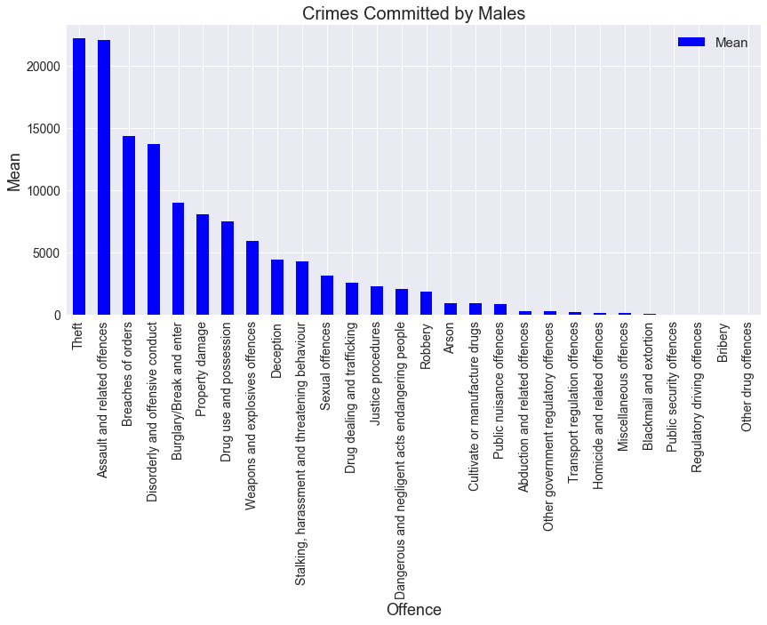


### Crimes committed by females


```python
#unsorted
femalecrimes=CatGenderDt[CatGenderDt.Gender=='F'].sort_values(by= 'Mean', ascending=False)
femalecrimes.index=femalecrimes.Category
del femalecrimes['Category']
```


```python
femalecrimes.head()
```


<div>
<style>
    .dataframe thead tr:only-child th {
        text-align: right;
    }

    .dataframe thead th {
        text-align: left;
    }

    .dataframe tbody tr th {
        vertical-align: top;
    }
</style>
<table border="1" class="dataframe">
  <thead>
    <tr style="text-align: right;">
      <th></th>
      <th>Gender</th>
      <th>2012</th>
      <th>2013</th>
      <th>2014</th>
      <th>2015</th>
      <th>2016</th>
      <th>Mean</th>
      <th>Offence</th>
    </tr>
    <tr>
      <th>Category</th>
      <th></th>
      <th></th>
      <th></th>
      <th></th>
      <th></th>
      <th></th>
      <th></th>
      <th></th>
    </tr>
  </thead>
  <tbody>
    <tr>
      <th>B40</th>
      <td>F</td>
      <td>8899.0</td>
      <td>9528</td>
      <td>7686.0</td>
      <td>8392.0</td>
      <td>9754.0</td>
      <td>8851.8</td>
      <td>Theft</td>
    </tr>
    <tr>
      <th>A20</th>
      <td>F</td>
      <td>4885.0</td>
      <td>5429</td>
      <td>5650.0</td>
      <td>5846.0</td>
      <td>6467.0</td>
      <td>5655.4</td>
      <td>Assault and related offences</td>
    </tr>
    <tr>
      <th>E20</th>
      <td>F</td>
      <td>2245.0</td>
      <td>2791</td>
      <td>4134.0</td>
      <td>4428.0</td>
      <td>5077.0</td>
      <td>3735.0</td>
      <td>Breaches of orders</td>
    </tr>
    <tr>
      <th>C30</th>
      <td>F</td>
      <td>1370.0</td>
      <td>1600</td>
      <td>1871.0</td>
      <td>2209.0</td>
      <td>2380.0</td>
      <td>1886.0</td>
      <td>Drug use and possession</td>
    </tr>
    <tr>
      <th>D20</th>
      <td>F</td>
      <td>2105.0</td>
      <td>2085</td>
      <td>1944.0</td>
      <td>1657.0</td>
      <td>1467.0</td>
      <td>1851.6</td>
      <td>Disorderly and offensive conduct</td>
    </tr>
  </tbody>
</table>
</div>


```python
femalecrimes.plot(x='Offence', y='Mean', kind='bar', figsize=(14,6),color='red')
plt.title('Crimes Committed by Females', fontsize=20)
plt.ylabel('Mean', fontsize=18)
plt.xlabel('Offence', fontsize=18)
plt.xticks(fontsize=14)
plt.yticks(fontsize=14)
plt.legend(loc='upper right', fontsize=15)
plt.show();
```


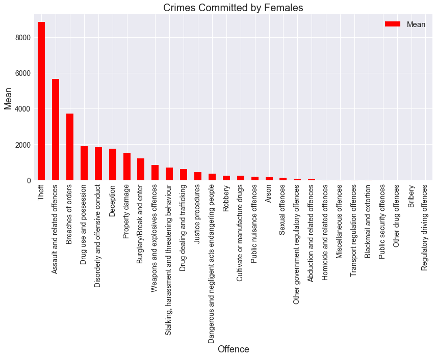


### Gender x Year

To do?


```python
(CatGenderDt.groupby(by='Gender').mean().T[:5])[['M', 'F']]
```


<div>
<style>
    .dataframe thead tr:only-child th {
        text-align: right;
    }

    .dataframe thead th {
        text-align: left;
    }

    .dataframe tbody tr th {
        vertical-align: top;
    }
</style>
<table border="1" class="dataframe">
  <thead>
    <tr style="text-align: right;">
      <th>Gender</th>
      <th>M</th>
      <th>F</th>
    </tr>
  </thead>
  <tbody>
    <tr>
      <th>2012</th>
      <td>4262.555556</td>
      <td>1107.958333</td>
    </tr>
    <tr>
      <th>2013</th>
      <td>4381.928571</td>
      <td>1057.142857</td>
    </tr>
    <tr>
      <th>2014</th>
      <td>4603.000000</td>
      <td>1137.769231</td>
    </tr>
    <tr>
      <th>2015</th>
      <td>4750.222222</td>
      <td>1215.846154</td>
    </tr>
    <tr>
      <th>2016</th>
      <td>5121.535714</td>
      <td>1366.423077</td>
    </tr>
  </tbody>
</table>
</div>


```python
(CatGenderDt.groupby(by='Gender').mean().T[:5])[['M', 'F']].plot(kind='bar', figsize=(14,9), color=('blue', 'red'))


plt.title('Gender Distribution of Crimes per Year', fontsize=20)


plt.ylabel('Mean', fontsize=18)
plt.xlabel('Year', fontsize=18)
plt.xticks(fontsize=14)
plt.yticks(fontsize=14)
plt.legend(loc='upper right', fontsize=15)
plt.show();
```


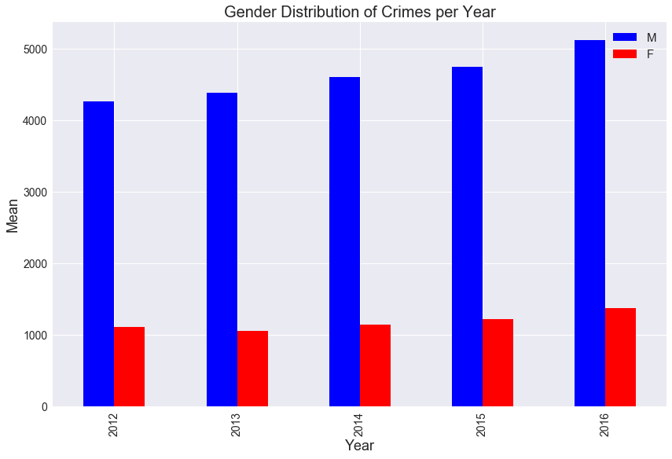


### Year x Crime

To do?

## <font color=red>__- Theft, Assault/related offences and Breaches of orders are the top three crimes for both males and females. Sexual offences are at 11th place for males but further down for females__ </font>

# Crime by age x gender


```python
AgeGenderCrime=pd.read_csv('Crimebyagexgender.csv', encoding='cp1252')
CatGenderDt.shape
```


    (56, 9)


```python
AgeGenderCrime.head()
```


<div>
<style>
    .dataframe thead tr:only-child th {
        text-align: right;
    }

    .dataframe thead th {
        text-align: left;
    }

    .dataframe tbody tr th {
        vertical-align: top;
    }
</style>
<table border="1" class="dataframe">
  <thead>
    <tr style="text-align: right;">
      <th></th>
      <th>gender</th>
      <th>AgeGroups</th>
      <th>y_2012</th>
      <th>y_2013</th>
      <th>y_2014</th>
      <th>y_2015</th>
      <th>y_2016</th>
    </tr>
  </thead>
  <tbody>
    <tr>
      <th>0</th>
      <td>M</td>
      <td>10–14</td>
      <td>2595.638902</td>
      <td>2376.912011</td>
      <td>2267.883174</td>
      <td>2358.101608</td>
      <td>2323.021828</td>
    </tr>
    <tr>
      <th>1</th>
      <td>M</td>
      <td>15–19</td>
      <td>11836.970260</td>
      <td>11526.769310</td>
      <td>11041.647460</td>
      <td>10785.747560</td>
      <td>11158.809960</td>
    </tr>
    <tr>
      <th>2</th>
      <td>M</td>
      <td>20–24</td>
      <td>10720.401060</td>
      <td>10762.610250</td>
      <td>10478.154220</td>
      <td>9828.549377</td>
      <td>11091.156770</td>
    </tr>
    <tr>
      <th>3</th>
      <td>M</td>
      <td>25–29</td>
      <td>7808.940970</td>
      <td>8370.995734</td>
      <td>8508.822491</td>
      <td>8673.426816</td>
      <td>9611.166840</td>
    </tr>
    <tr>
      <th>4</th>
      <td>M</td>
      <td>30–34</td>
      <td>7040.423626</td>
      <td>7631.598858</td>
      <td>7692.202099</td>
      <td>8036.067073</td>
      <td>8802.186815</td>
    </tr>
  </tbody>
</table>
</div>


```python
AgeGenderCrime['AgeGroups']=AgeGenderCrime['AgeGroups'].replace('65 years and over', '65+')
AgeGenderCrime.columns=['gender', 'AgeGroups', '2012', '2013', '2014', '2015', '2016']
# Mean of the 5 years per Agegroup
AgeGenderCrime['Mean']=[AgeGenderCrime[['2012', '2013', '2014', '2015', '2016']].iloc[i].mean() for i in range(AgeGenderCrime.shape[0])]
```


```python
AgeGenderCrime.head()
```


<div>
<style>
    .dataframe thead tr:only-child th {
        text-align: right;
    }

    .dataframe thead th {
        text-align: left;
    }

    .dataframe tbody tr th {
        vertical-align: top;
    }
</style>
<table border="1" class="dataframe">
  <thead>
    <tr style="text-align: right;">
      <th></th>
      <th>gender</th>
      <th>AgeGroups</th>
      <th>2012</th>
      <th>2013</th>
      <th>2014</th>
      <th>2015</th>
      <th>2016</th>
      <th>Mean</th>
    </tr>
  </thead>
  <tbody>
    <tr>
      <th>0</th>
      <td>M</td>
      <td>10–14</td>
      <td>2595.638902</td>
      <td>2376.912011</td>
      <td>2267.883174</td>
      <td>2358.101608</td>
      <td>2323.021828</td>
      <td>2384.311505</td>
    </tr>
    <tr>
      <th>1</th>
      <td>M</td>
      <td>15–19</td>
      <td>11836.970260</td>
      <td>11526.769310</td>
      <td>11041.647460</td>
      <td>10785.747560</td>
      <td>11158.809960</td>
      <td>11269.988910</td>
    </tr>
    <tr>
      <th>2</th>
      <td>M</td>
      <td>20–24</td>
      <td>10720.401060</td>
      <td>10762.610250</td>
      <td>10478.154220</td>
      <td>9828.549377</td>
      <td>11091.156770</td>
      <td>10576.174335</td>
    </tr>
    <tr>
      <th>3</th>
      <td>M</td>
      <td>25–29</td>
      <td>7808.940970</td>
      <td>8370.995734</td>
      <td>8508.822491</td>
      <td>8673.426816</td>
      <td>9611.166840</td>
      <td>8594.670570</td>
    </tr>
    <tr>
      <th>4</th>
      <td>M</td>
      <td>30–34</td>
      <td>7040.423626</td>
      <td>7631.598858</td>
      <td>7692.202099</td>
      <td>8036.067073</td>
      <td>8802.186815</td>
      <td>7840.495694</td>
    </tr>
  </tbody>
</table>
</div>


```python
AgeGenderCrime[AgeGenderCrime.isnull().any(axis=1)]
```


<div>
<style>
    .dataframe thead tr:only-child th {
        text-align: right;
    }

    .dataframe thead th {
        text-align: left;
    }

    .dataframe tbody tr th {
        vertical-align: top;
    }
</style>
<table border="1" class="dataframe">
  <thead>
    <tr style="text-align: right;">
      <th></th>
      <th>gender</th>
      <th>AgeGroups</th>
      <th>2012</th>
      <th>2013</th>
      <th>2014</th>
      <th>2015</th>
      <th>2016</th>
      <th>Mean</th>
    </tr>
  </thead>
  <tbody>
  </tbody>
</table>
</div>


### Gender x Age


```python
plt.figure (figsize=(14,6))
sns.barplot(x='AgeGroups', y='Mean', data=AgeGenderCrime, hue='gender', palette=('blue', 'red'))
plt.title('Gender Distribution of Crimes per Age Group', fontsize=20)
plt.ylabel('Mean', fontsize=18)
plt.xlabel('Age Group', fontsize=18)
plt.legend(title='Gender', loc='upper right', fontsize=15)
plt.xticks(fontsize=14)
plt.yticks(fontsize=14)
plt.show();
```


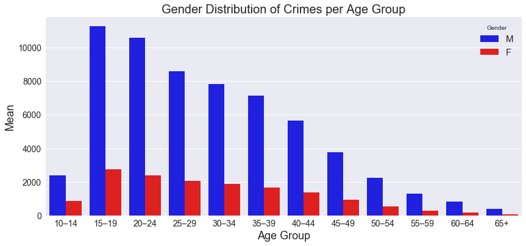


### Age x Yearly Crimes


```python
AgeGenderCrime[['AgeGroups','2012', '2013', '2014', '2015', '2016']].groupby(by='AgeGroups').sum()
```


<div>
<style>
    .dataframe thead tr:only-child th {
        text-align: right;
    }

    .dataframe thead th {
        text-align: left;
    }

    .dataframe tbody tr th {
        vertical-align: top;
    }
</style>
<table border="1" class="dataframe">
  <thead>
    <tr style="text-align: right;">
      <th></th>
      <th>2012</th>
      <th>2013</th>
      <th>2014</th>
      <th>2015</th>
      <th>2016</th>
    </tr>
    <tr>
      <th>AgeGroups</th>
      <th></th>
      <th></th>
      <th></th>
      <th></th>
      <th></th>
    </tr>
  </thead>
  <tbody>
    <tr>
      <th>10–14</th>
      <td>3545.850543</td>
      <td>3176.011409</td>
      <td>3051.392345</td>
      <td>3218.115489</td>
      <td>3262.679995</td>
    </tr>
    <tr>
      <th>15–19</th>
      <td>14770.098854</td>
      <td>14412.451244</td>
      <td>13734.935188</td>
      <td>13268.263054</td>
      <td>13934.429748</td>
    </tr>
    <tr>
      <th>20–24</th>
      <td>12795.223253</td>
      <td>13130.348890</td>
      <td>12822.562155</td>
      <td>12268.796583</td>
      <td>13849.804522</td>
    </tr>
    <tr>
      <th>25–29</th>
      <td>9496.048997</td>
      <td>10192.732281</td>
      <td>10423.533247</td>
      <td>10983.243866</td>
      <td>12091.970655</td>
    </tr>
    <tr>
      <th>30–34</th>
      <td>8645.836920</td>
      <td>9509.142940</td>
      <td>9519.070487</td>
      <td>10007.109832</td>
      <td>10955.189218</td>
    </tr>
    <tr>
      <th>35–39</th>
      <td>7540.030924</td>
      <td>8407.145472</td>
      <td>8617.606497</td>
      <td>9196.320681</td>
      <td>10255.060696</td>
    </tr>
    <tr>
      <th>40–44</th>
      <td>5890.507399</td>
      <td>6695.598670</td>
      <td>6723.459477</td>
      <td>7329.495557</td>
      <td>8413.922751</td>
    </tr>
    <tr>
      <th>45–49</th>
      <td>3748.193181</td>
      <td>4455.993797</td>
      <td>4805.312496</td>
      <td>4808.190353</td>
      <td>5686.978635</td>
    </tr>
    <tr>
      <th>50–54</th>
      <td>2275.825287</td>
      <td>2609.729538</td>
      <td>2723.237774</td>
      <td>2939.016042</td>
      <td>3376.967075</td>
    </tr>
    <tr>
      <th>55–59</th>
      <td>1449.556399</td>
      <td>1587.340122</td>
      <td>1558.866006</td>
      <td>1695.398180</td>
      <td>1640.807667</td>
    </tr>
    <tr>
      <th>60–64</th>
      <td>888.191299</td>
      <td>1069.471345</td>
      <td>979.000138</td>
      <td>1060.889404</td>
      <td>1070.881651</td>
    </tr>
    <tr>
      <th>65+</th>
      <td>409.305280</td>
      <td>488.148764</td>
      <td>438.881037</td>
      <td>430.401139</td>
      <td>521.021820</td>
    </tr>
  </tbody>
</table>
</div>


```python
#combined female and male crime per agegroup
(AgeGenderCrime[['AgeGroups','2012', '2013', '2014', '2015', '2016']].groupby(by='AgeGroups').sum()).plot(kind='line', figsize=(14,6), linewidth=3, marker='o')
plt.title('Yearly Distribution of Crimes per Age Groups', fontsize=20)
plt.ylabel('Total', fontsize=18)
plt.xlabel('Age Group', fontsize=18)
plt.legend(title='Year', loc='upper right', fontsize=15)
plt.xticks(fontsize=14)
plt.yticks(fontsize=14)
plt.show();
```


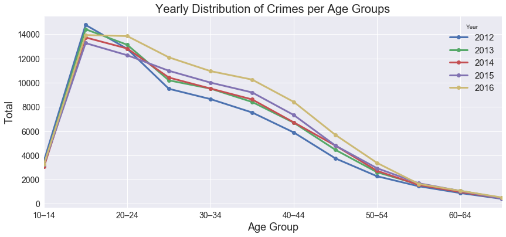


### Gender x Yearly Crimes


```python
(AgeGenderCrime.groupby(by='gender').mean().T[:5])[['M', 'F']]
```


<div>
<style>
    .dataframe thead tr:only-child th {
        text-align: right;
    }

    .dataframe thead th {
        text-align: left;
    }

    .dataframe tbody tr th {
        vertical-align: top;
    }
</style>
<table border="1" class="dataframe">
  <thead>
    <tr style="text-align: right;">
      <th>gender</th>
      <th>M</th>
      <th>F</th>
    </tr>
  </thead>
  <tbody>
    <tr>
      <th>2012</th>
      <td>4822.900856</td>
      <td>1131.654839</td>
    </tr>
    <tr>
      <th>2013</th>
      <td>5077.268400</td>
      <td>1233.907807</td>
    </tr>
    <tr>
      <th>2014</th>
      <td>5068.593802</td>
      <td>1214.560935</td>
    </tr>
    <tr>
      <th>2015</th>
      <td>5160.631231</td>
      <td>1273.138784</td>
    </tr>
    <tr>
      <th>2016</th>
      <td>5676.691656</td>
      <td>1411.617880</td>
    </tr>
  </tbody>
</table>
</div>


```python
(AgeGenderCrime.groupby(by='gender').mean().T[:5])[['M', 'F']].plot(kind='bar', figsize=(14,6), color=('blue', 'red'))
plt.title('Gender Distribution of Crimes per Year', fontsize=20)
plt.ylabel('Mean', fontsize=18)
plt.xlabel('Year', fontsize=18)
plt.legend(title='Gender', loc='upper right', fontsize=15)
plt.xticks(fontsize=14)
plt.yticks(fontsize=14)
plt.show();
```


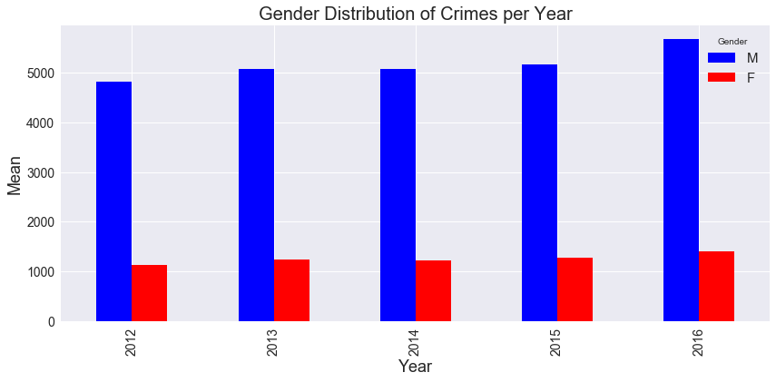


## <font color=red> - __15-19 year old males and females are more likely to commit a crime. - 2016 saw an increase in crimes by both males and females in most age groups__ </font>

# Sex Offenders


```python
SexOffendrs=pd.read_csv('sexoffenders.csv')
SexOffendrs.shape
```


    (24, 7)


```python
SexOffendrs.head()
```


<div>
<style>
    .dataframe thead tr:only-child th {
        text-align: right;
    }

    .dataframe thead th {
        text-align: left;
    }

    .dataframe tbody tr th {
        vertical-align: top;
    }
</style>
<table border="1" class="dataframe">
  <thead>
    <tr style="text-align: right;">
      <th></th>
      <th>gender</th>
      <th>AgeGroup</th>
      <th>y_2012</th>
      <th>y_2013</th>
      <th>y_2014</th>
      <th>y_2015</th>
      <th>y_2016</th>
    </tr>
  </thead>
  <tbody>
    <tr>
      <th>0</th>
      <td>M</td>
      <td>Oct-14</td>
      <td>120.0</td>
      <td>125.0</td>
      <td>133.0</td>
      <td>117.0</td>
      <td>149.0</td>
    </tr>
    <tr>
      <th>1</th>
      <td>M</td>
      <td>15-19</td>
      <td>346.0</td>
      <td>367.0</td>
      <td>423.0</td>
      <td>349.0</td>
      <td>447.0</td>
    </tr>
    <tr>
      <th>2</th>
      <td>M</td>
      <td>20-24</td>
      <td>303.0</td>
      <td>308.0</td>
      <td>362.0</td>
      <td>367.0</td>
      <td>426.0</td>
    </tr>
    <tr>
      <th>3</th>
      <td>M</td>
      <td>25-29</td>
      <td>271.0</td>
      <td>304.0</td>
      <td>302.0</td>
      <td>324.0</td>
      <td>351.0</td>
    </tr>
    <tr>
      <th>4</th>
      <td>M</td>
      <td>30-34</td>
      <td>248.0</td>
      <td>251.0</td>
      <td>276.0</td>
      <td>320.0</td>
      <td>365.0</td>
    </tr>
  </tbody>
</table>
</div>


```python
SexOffendrs['AgeGroup']=SexOffendrs.AgeGroup.replace('Oct-14', '10-14')
SexOffendrs['AgeGroup']=SexOffendrs.AgeGroup.replace('65 years and over', '65+')
SexOffendrs.columns = ['gender', 'AgeGroup', '2012', '2013', '2014', '2015', '2016']
# mean offender for 5 year in each row
SexOffendrs['Mean']=[(SexOffendrs[['2012', '2013', '2014', '2015', '2016']].iloc[i].mean()) for i in range(SexOffendrs.shape[0])]
```


```python
SexOffendrs.head()
```


<div>
<style>
    .dataframe thead tr:only-child th {
        text-align: right;
    }

    .dataframe thead th {
        text-align: left;
    }

    .dataframe tbody tr th {
        vertical-align: top;
    }
</style>
<table border="1" class="dataframe">
  <thead>
    <tr style="text-align: right;">
      <th></th>
      <th>gender</th>
      <th>AgeGroup</th>
      <th>2012</th>
      <th>2013</th>
      <th>2014</th>
      <th>2015</th>
      <th>2016</th>
      <th>Mean</th>
    </tr>
  </thead>
  <tbody>
    <tr>
      <th>0</th>
      <td>M</td>
      <td>10-14</td>
      <td>120.0</td>
      <td>125.0</td>
      <td>133.0</td>
      <td>117.0</td>
      <td>149.0</td>
      <td>128.8</td>
    </tr>
    <tr>
      <th>1</th>
      <td>M</td>
      <td>15-19</td>
      <td>346.0</td>
      <td>367.0</td>
      <td>423.0</td>
      <td>349.0</td>
      <td>447.0</td>
      <td>386.4</td>
    </tr>
    <tr>
      <th>2</th>
      <td>M</td>
      <td>20-24</td>
      <td>303.0</td>
      <td>308.0</td>
      <td>362.0</td>
      <td>367.0</td>
      <td>426.0</td>
      <td>353.2</td>
    </tr>
    <tr>
      <th>3</th>
      <td>M</td>
      <td>25-29</td>
      <td>271.0</td>
      <td>304.0</td>
      <td>302.0</td>
      <td>324.0</td>
      <td>351.0</td>
      <td>310.4</td>
    </tr>
    <tr>
      <th>4</th>
      <td>M</td>
      <td>30-34</td>
      <td>248.0</td>
      <td>251.0</td>
      <td>276.0</td>
      <td>320.0</td>
      <td>365.0</td>
      <td>292.0</td>
    </tr>
  </tbody>
</table>
</div>


```python
SexOffendrs[SexOffendrs.isnull().any(axis=1)]
```


<div>
<style>
    .dataframe thead tr:only-child th {
        text-align: right;
    }

    .dataframe thead th {
        text-align: left;
    }

    .dataframe tbody tr th {
        vertical-align: top;
    }
</style>
<table border="1" class="dataframe">
  <thead>
    <tr style="text-align: right;">
      <th></th>
      <th>gender</th>
      <th>AgeGroup</th>
      <th>2012</th>
      <th>2013</th>
      <th>2014</th>
      <th>2015</th>
      <th>2016</th>
      <th>Mean</th>
    </tr>
  </thead>
  <tbody>
    <tr>
      <th>20</th>
      <td>F</td>
      <td>50-54</td>
      <td>NaN</td>
      <td>6.0</td>
      <td>11.0</td>
      <td>6.0</td>
      <td>9.0</td>
      <td>8.000000</td>
    </tr>
    <tr>
      <th>22</th>
      <td>F</td>
      <td>60-64</td>
      <td>NaN</td>
      <td>NaN</td>
      <td>NaN</td>
      <td>NaN</td>
      <td>NaN</td>
      <td>NaN</td>
    </tr>
    <tr>
      <th>23</th>
      <td>F</td>
      <td>65+</td>
      <td>NaN</td>
      <td>7.0</td>
      <td>NaN</td>
      <td>5.0</td>
      <td>5.0</td>
      <td>5.666667</td>
    </tr>
  </tbody>
</table>
</div>


### Age Group x Gender


```python
#Mean Sex Offenders per Age Group for F and M
plt.figure(figsize=(14,6))
sns.barplot(x = 'AgeGroup', y = "Mean", data = SexOffendrs, hue='gender', palette=('blue', 'red'))
plt.title('Gender Distribution of Sex Offenders per Age Group', fontsize=20)
plt.ylabel('Mean', fontsize=18)
plt.xlabel('Age Group', fontsize=18)
plt.legend(title='Gender', loc='upper right', fontsize=15)
plt.xticks(fontsize=14)
plt.yticks(fontsize=14)
plt.show();
```


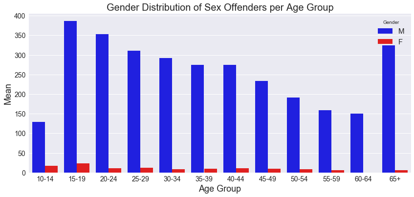


*Data not complete for 50-54 and 60+ Females

### Year x Gender


```python
#Mean Sex Offenders per Year for F and M
(SexOffendrs.groupby(by=['gender']).mean().T[:5])[['M','F']]
```


<div>
<style>
    .dataframe thead tr:only-child th {
        text-align: right;
    }

    .dataframe thead th {
        text-align: left;
    }

    .dataframe tbody tr th {
        vertical-align: top;
    }
</style>
<table border="1" class="dataframe">
  <thead>
    <tr style="text-align: right;">
      <th>gender</th>
      <th>M</th>
      <th>F</th>
    </tr>
  </thead>
  <tbody>
    <tr>
      <th>2012</th>
      <td>224.250000</td>
      <td>10.333333</td>
    </tr>
    <tr>
      <th>2013</th>
      <td>239.416667</td>
      <td>10.727273</td>
    </tr>
    <tr>
      <th>2014</th>
      <td>257.000000</td>
      <td>10.600000</td>
    </tr>
    <tr>
      <th>2015</th>
      <td>259.583333</td>
      <td>10.000000</td>
    </tr>
    <tr>
      <th>2016</th>
      <td>302.666667</td>
      <td>14.454545</td>
    </tr>
  </tbody>
</table>
</div>


```python
(SexOffendrs.groupby(by=['gender']).mean().T[:5])[['M','F']].plot(kind='bar', figsize=(14,6), color=('blue', 'red'))
plt.title('Gender Distribution of Sex Offenders per Year', fontsize=20)
plt.xlabel('Year', fontsize=18)
plt.ylabel('Mean', fontsize=18)
plt.legend(title='Gender', loc='upper left', fontsize=15)
plt.xticks(fontsize=14)
plt.yticks(fontsize=14)
plt.show();
```


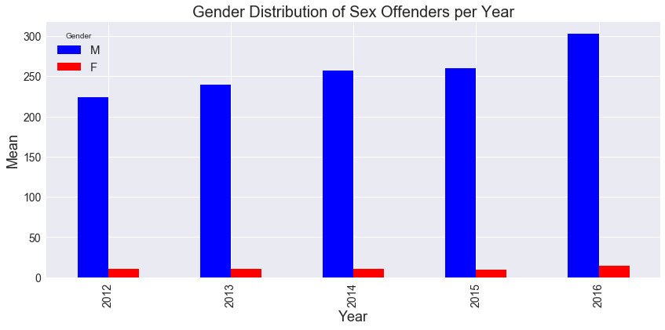


### Age Group x Year


```python
#Total Sex Offenders per Age Group
AgeYear =SexOffendrs[['AgeGroup', '2012', '2013', '2014', '2015', '2016']].groupby(by='AgeGroup').sum()
AgeYear
```


<div>
<style>
    .dataframe thead tr:only-child th {
        text-align: right;
    }

    .dataframe thead th {
        text-align: left;
    }

    .dataframe tbody tr th {
        vertical-align: top;
    }
</style>
<table border="1" class="dataframe">
  <thead>
    <tr style="text-align: right;">
      <th></th>
      <th>2012</th>
      <th>2013</th>
      <th>2014</th>
      <th>2015</th>
      <th>2016</th>
    </tr>
    <tr>
      <th>AgeGroup</th>
      <th></th>
      <th></th>
      <th></th>
      <th></th>
      <th></th>
    </tr>
  </thead>
  <tbody>
    <tr>
      <th>10-14</th>
      <td>130.0</td>
      <td>147.0</td>
      <td>144.0</td>
      <td>132.0</td>
      <td>174.0</td>
    </tr>
    <tr>
      <th>15-19</th>
      <td>370.0</td>
      <td>387.0</td>
      <td>440.0</td>
      <td>376.0</td>
      <td>476.0</td>
    </tr>
    <tr>
      <th>20-24</th>
      <td>308.0</td>
      <td>324.0</td>
      <td>377.0</td>
      <td>372.0</td>
      <td>437.0</td>
    </tr>
    <tr>
      <th>25-29</th>
      <td>279.0</td>
      <td>314.0</td>
      <td>313.0</td>
      <td>337.0</td>
      <td>368.0</td>
    </tr>
    <tr>
      <th>30-34</th>
      <td>253.0</td>
      <td>262.0</td>
      <td>281.0</td>
      <td>330.0</td>
      <td>377.0</td>
    </tr>
    <tr>
      <th>35-39</th>
      <td>261.0</td>
      <td>254.0</td>
      <td>301.0</td>
      <td>270.0</td>
      <td>339.0</td>
    </tr>
    <tr>
      <th>40-44</th>
      <td>271.0</td>
      <td>286.0</td>
      <td>272.0</td>
      <td>284.0</td>
      <td>317.0</td>
    </tr>
    <tr>
      <th>45-49</th>
      <td>216.0</td>
      <td>238.0</td>
      <td>245.0</td>
      <td>223.0</td>
      <td>294.0</td>
    </tr>
    <tr>
      <th>50-54</th>
      <td>194.0</td>
      <td>187.0</td>
      <td>192.0</td>
      <td>190.0</td>
      <td>227.0</td>
    </tr>
    <tr>
      <th>55-59</th>
      <td>145.0</td>
      <td>159.0</td>
      <td>171.0</td>
      <td>155.0</td>
      <td>193.0</td>
    </tr>
    <tr>
      <th>60-64</th>
      <td>116.0</td>
      <td>143.0</td>
      <td>139.0</td>
      <td>185.0</td>
      <td>170.0</td>
    </tr>
    <tr>
      <th>65+</th>
      <td>241.0</td>
      <td>290.0</td>
      <td>315.0</td>
      <td>371.0</td>
      <td>419.0</td>
    </tr>
  </tbody>
</table>
</div>


```python
plt.figure('By age group')
AgeYear.plot(y=['2012', '2013', '2014', '2015', '2016'] , kind='line', figsize=(14,6), linewidth=3, marker='o')
plt.title('Yearly Distribution of Sex Offenders per Age Group', fontsize=20)
plt.legend(title='Year', loc='best', fontsize=15)
plt.xlabel('Age Group', fontsize=18)
plt.ylabel('Total', fontsize=18)
plt.xticks(fontsize=14)
plt.yticks(fontsize=14)
plt.show();
```


    <matplotlib.figure.Figure at 0x1cbb9ec9be0>


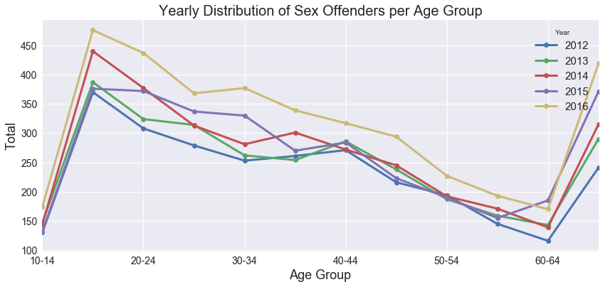


*Data not complete for 50-54 and 60+ Females

## <font color=red> - __15-19 year old males and females are more likely to be a sex offender (similar to crimes in general). But male are more likely to be sex offenders than female. 65+ males are more likely to be sex offenders than general criminals - 2016 saw an increase in sex crimes by both males and females for all age groups contributing to the increase in total crimes in 2016__ </font>

# Victims of sexual offence


```python
dt=pd.read_excel('victimsofsexualoffence.xlsx')
dt.shape
```


    (28, 7)


```python
(dt['AgeGroup']).iloc[2]='10-14'
(dt['AgeGroup']).iloc[16]='10-14'
dt['AgeGroup']=dt.AgeGroup.replace('65 years and over', '65+')
dt['AgeGroup']=dt.AgeGroup.replace('0–4','00-04')
dt['AgeGroup']=dt.AgeGroup.replace('5–9','05-09')
dt.columns = ['gender', 'AgeGroup', '2012', '2013', '2014', '2015', '2016']
dt['Mean']=[dt[['2012', '2013', '2014', '2015', '2016']].iloc[i].mean() for i in range(dt.shape[0])]
```

    C:\Users\VinTab\Desktop\programming\Anaconda3\lib\site-packages\pandas\core\indexing.py:179: SettingWithCopyWarning: 
    A value is trying to be set on a copy of a slice from a DataFrame
    
    See the caveats in the documentation: http://pandas.pydata.org/pandas-docs/stable/indexing.html#indexing-view-versus-copy
      self._setitem_with_indexer(indexer, value)
    


```python
dt.head()
```


<div>
<style>
    .dataframe thead tr:only-child th {
        text-align: right;
    }

    .dataframe thead th {
        text-align: left;
    }

    .dataframe tbody tr th {
        vertical-align: top;
    }
</style>
<table border="1" class="dataframe">
  <thead>
    <tr style="text-align: right;">
      <th></th>
      <th>gender</th>
      <th>AgeGroup</th>
      <th>2012</th>
      <th>2013</th>
      <th>2014</th>
      <th>2015</th>
      <th>2016</th>
      <th>Mean</th>
    </tr>
  </thead>
  <tbody>
    <tr>
      <th>0</th>
      <td>M</td>
      <td>00-04</td>
      <td>61</td>
      <td>50</td>
      <td>48</td>
      <td>67</td>
      <td>74</td>
      <td>60.0</td>
    </tr>
    <tr>
      <th>1</th>
      <td>M</td>
      <td>05-09</td>
      <td>157</td>
      <td>157</td>
      <td>176</td>
      <td>189</td>
      <td>228</td>
      <td>181.4</td>
    </tr>
    <tr>
      <th>2</th>
      <td>M</td>
      <td>10-14</td>
      <td>186</td>
      <td>166</td>
      <td>177</td>
      <td>205</td>
      <td>284</td>
      <td>203.6</td>
    </tr>
    <tr>
      <th>3</th>
      <td>M</td>
      <td>15-19</td>
      <td>137</td>
      <td>118</td>
      <td>154</td>
      <td>161</td>
      <td>186</td>
      <td>151.2</td>
    </tr>
    <tr>
      <th>4</th>
      <td>M</td>
      <td>20-24</td>
      <td>62</td>
      <td>70</td>
      <td>69</td>
      <td>72</td>
      <td>92</td>
      <td>73.0</td>
    </tr>
  </tbody>
</table>
</div>


```python
dt[dt.isnull().any(axis=1)]
```


<div>
<style>
    .dataframe thead tr:only-child th {
        text-align: right;
    }

    .dataframe thead th {
        text-align: left;
    }

    .dataframe tbody tr th {
        vertical-align: top;
    }
</style>
<table border="1" class="dataframe">
  <thead>
    <tr style="text-align: right;">
      <th></th>
      <th>gender</th>
      <th>AgeGroup</th>
      <th>2012</th>
      <th>2013</th>
      <th>2014</th>
      <th>2015</th>
      <th>2016</th>
      <th>Mean</th>
    </tr>
  </thead>
  <tbody>
  </tbody>
</table>
</div>


### Age Group x Gender


```python
#Mean Victims of Sexual Offences per Age Group for F and M
plt.figure(figsize=(14,6))
sns.barplot(x = 'AgeGroup', y = "Mean", data = dt, hue='gender', palette=('blue', 'red'))
plt.title('Gender Distribution of Victims of Sexual Offences per Age Group', fontsize=20)
plt.xlabel('Age Group', fontsize=18)
plt.ylabel('Mean', fontsize=18)
plt.legend(title='Gender', loc='upper right', fontsize=15)
plt.xticks(fontsize=14)
plt.yticks(fontsize=14)
plt.show();
```


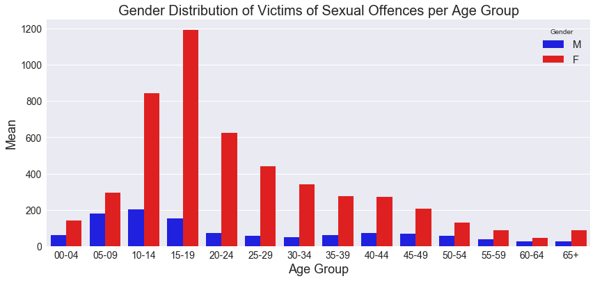


### Year x Gender


```python
#Mean Victims of Sexual Offences per Year for F and M
(dt.groupby(by=['gender']).mean().T[:5])[['M', 'F']]
```


<div>
<style>
    .dataframe thead tr:only-child th {
        text-align: right;
    }

    .dataframe thead th {
        text-align: left;
    }

    .dataframe tbody tr th {
        vertical-align: top;
    }
</style>
<table border="1" class="dataframe">
  <thead>
    <tr style="text-align: right;">
      <th>gender</th>
      <th>M</th>
      <th>F</th>
    </tr>
  </thead>
  <tbody>
    <tr>
      <th>2012</th>
      <td>64.000000</td>
      <td>308.000000</td>
    </tr>
    <tr>
      <th>2013</th>
      <td>67.428571</td>
      <td>330.357143</td>
    </tr>
    <tr>
      <th>2014</th>
      <td>78.142857</td>
      <td>339.214286</td>
    </tr>
    <tr>
      <th>2015</th>
      <td>87.571429</td>
      <td>364.857143</td>
    </tr>
    <tr>
      <th>2016</th>
      <td>103.214286</td>
      <td>437.500000</td>
    </tr>
  </tbody>
</table>
</div>


```python
(dt.groupby(by=['gender']).mean().T[:5])[['M', 'F']].plot(kind='bar', figsize=(14,6), color=('blue', 'red'))
plt.title('Gender Distribution of Victims of Sexual Offences per Year', fontsize=20)
plt.xlabel('Year', fontsize=18)
plt.ylabel('Mean', fontsize=18)
plt.legend(title='Gender', loc='upper left', fontsize=15)
plt.xticks(fontsize=14)
plt.yticks(fontsize=14)
plt.show();
```


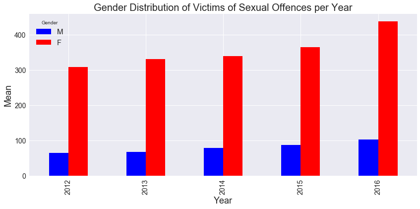


### Age Group x Year


```python
#Total Victims of Sexual Offences per Age Group
AgeYearVic = dt[['AgeGroup', '2012', '2013', '2014', '2015', '2016']].groupby(by='AgeGroup').sum()
AgeYearVic
```


<div>
<style>
    .dataframe thead tr:only-child th {
        text-align: right;
    }

    .dataframe thead th {
        text-align: left;
    }

    .dataframe tbody tr th {
        vertical-align: top;
    }
</style>
<table border="1" class="dataframe">
  <thead>
    <tr style="text-align: right;">
      <th></th>
      <th>2012</th>
      <th>2013</th>
      <th>2014</th>
      <th>2015</th>
      <th>2016</th>
    </tr>
    <tr>
      <th>AgeGroup</th>
      <th></th>
      <th></th>
      <th></th>
      <th></th>
      <th></th>
    </tr>
  </thead>
  <tbody>
    <tr>
      <th>00-04</th>
      <td>196</td>
      <td>204</td>
      <td>177</td>
      <td>198</td>
      <td>233</td>
    </tr>
    <tr>
      <th>05-09</th>
      <td>412</td>
      <td>450</td>
      <td>465</td>
      <td>505</td>
      <td>555</td>
    </tr>
    <tr>
      <th>10-14</th>
      <td>947</td>
      <td>936</td>
      <td>947</td>
      <td>1092</td>
      <td>1310</td>
    </tr>
    <tr>
      <th>15-19</th>
      <td>1220</td>
      <td>1217</td>
      <td>1253</td>
      <td>1345</td>
      <td>1682</td>
    </tr>
    <tr>
      <th>20-24</th>
      <td>649</td>
      <td>694</td>
      <td>651</td>
      <td>667</td>
      <td>836</td>
    </tr>
    <tr>
      <th>25-29</th>
      <td>400</td>
      <td>441</td>
      <td>463</td>
      <td>535</td>
      <td>647</td>
    </tr>
    <tr>
      <th>30-34</th>
      <td>331</td>
      <td>367</td>
      <td>380</td>
      <td>406</td>
      <td>461</td>
    </tr>
    <tr>
      <th>35-39</th>
      <td>284</td>
      <td>298</td>
      <td>312</td>
      <td>362</td>
      <td>426</td>
    </tr>
    <tr>
      <th>40-44</th>
      <td>281</td>
      <td>318</td>
      <td>353</td>
      <td>381</td>
      <td>388</td>
    </tr>
    <tr>
      <th>45-49</th>
      <td>170</td>
      <td>238</td>
      <td>305</td>
      <td>283</td>
      <td>379</td>
    </tr>
    <tr>
      <th>50-54</th>
      <td>121</td>
      <td>151</td>
      <td>188</td>
      <td>226</td>
      <td>264</td>
    </tr>
    <tr>
      <th>55-59</th>
      <td>79</td>
      <td>116</td>
      <td>148</td>
      <td>141</td>
      <td>134</td>
    </tr>
    <tr>
      <th>60-64</th>
      <td>39</td>
      <td>42</td>
      <td>82</td>
      <td>90</td>
      <td>88</td>
    </tr>
    <tr>
      <th>65+</th>
      <td>79</td>
      <td>97</td>
      <td>119</td>
      <td>103</td>
      <td>167</td>
    </tr>
  </tbody>
</table>
</div>


```python
#Victims of Sexual Offences per Age Group
AgeYearVic.plot(y=['2012', '2013', '2014', '2015', '2016'], kind='line', figsize=(14,6) , linewidth=3, marker='o')
plt.title('Yearly Distribution of Victims of Sexual Offences per Age Group', fontsize=20)
plt.xlabel('Age Group', fontsize=18)
plt.ylabel('Total', fontsize=18)
plt.legend(title='Year', loc='upper right', fontsize=15)
plt.xticks(fontsize=14)
plt.yticks(fontsize=14)
plt.show();
```


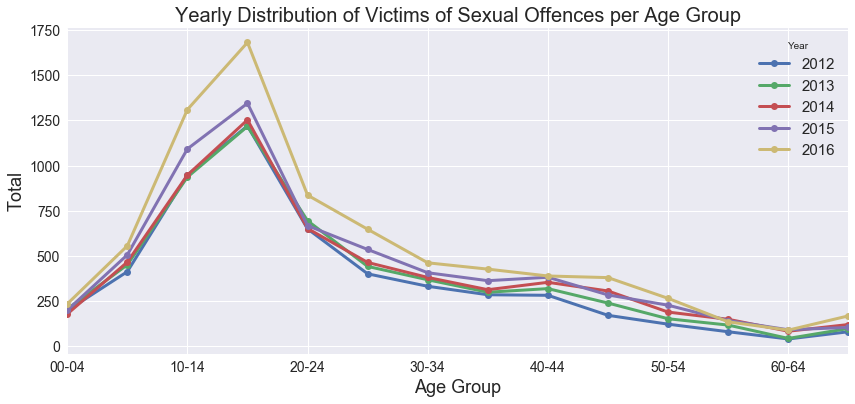


## <font color=red> - __15-19 year old females and 10-14 old males are more likely to be victims of sex crimes.  - 2016 saw an increase in both males and females victims of sex crimes for all age groups. This is consistent with the increase in offenders. __ </font>


```python

```
